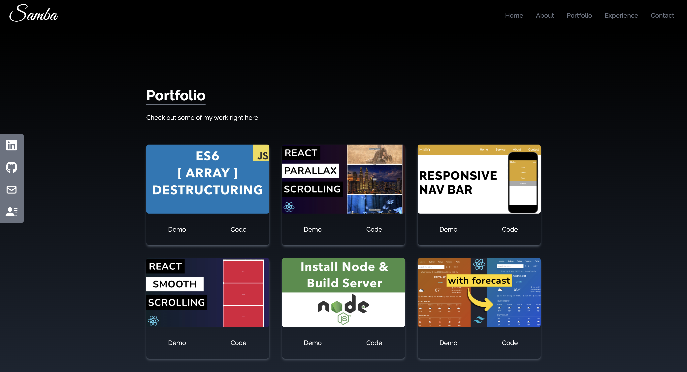
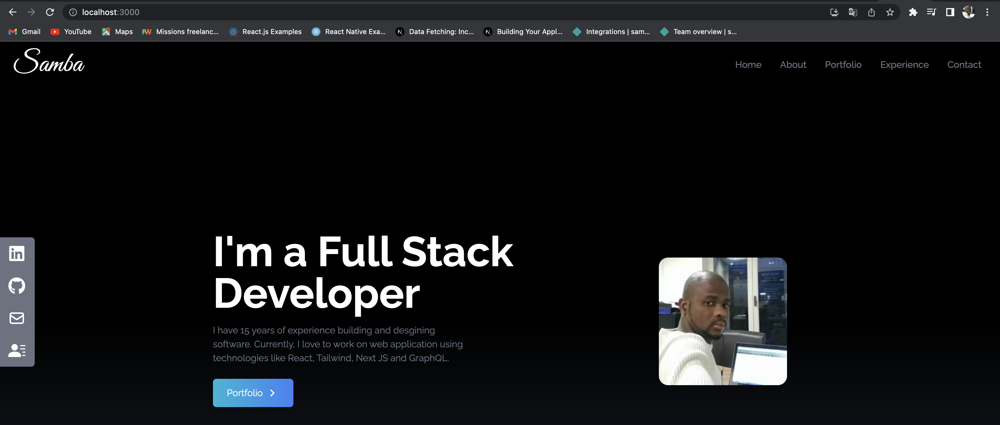
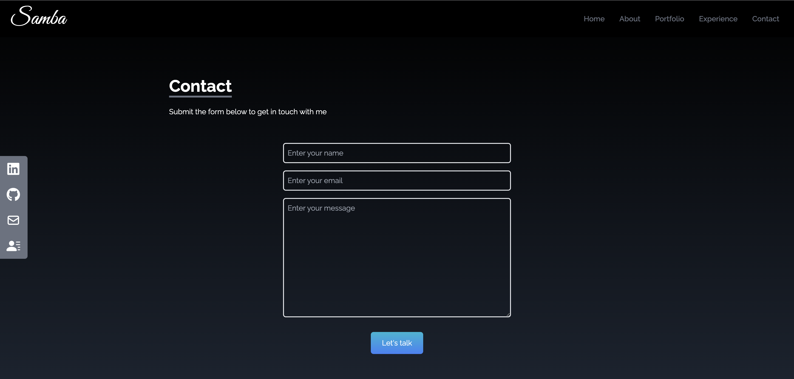

# React JS Portfolio Website Using Tailwind CSS - Build & Deploy

My take on responsive React portfolio website from scratch using Tailwind CSS and deploying it to server. 
In this tutorial, we will work with JavaScript, React, and Tailwind. 
You will learn a lot of amazing things 
1. tailwind 
2. smooth scroll 
3. social icons
4. custom font 
5. gradient background
6. responsive design. 

For deploying our project we will be using Netlify. We will use tailwind for our CSS instead of using custom CSS.

📚 Material:

Tailwind CSS: https://tailwindcss.com/docs/guides/c...
React Icons: https://react-icons.github.io/react-i...
Netlify: https://www.netlify.com
Project GitHub Link: https://www.buymeacoffee.com/pwyash/e...

💻 Screen shot   💻

🌏 ![demo] :(https://main--iridescent-mochi-bcf961.netlify.app/)