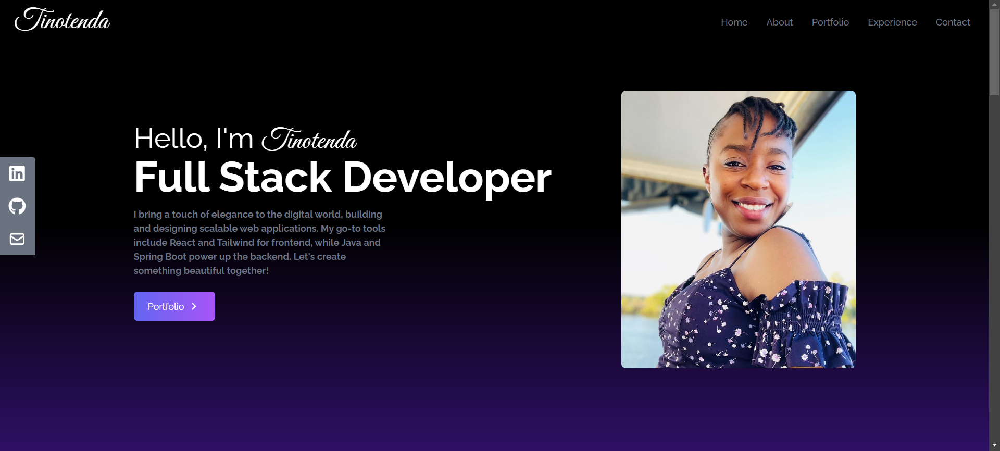

# My Portfolio

A responsive React portfolio website using Tailwind CSS and deploying it to server.

Will be using Netlify to deploy this website.

📚 Material:

Tailwind CSS: https://tailwindcss.com/docs/guides/c...
React Icons: https://react-icons.github.io/react-i...
Netlify: https://www.netlify.com

💻 Screen shot   💻

